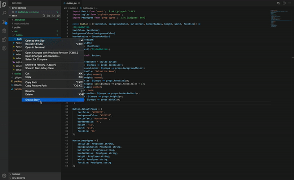

> ## Deprecation Notice!
>
> Due to ever changing Storybook Story format, I have decided to deprecate this VSCode extension.
> It makes more sense for you to use [PlopJS](https://plopjs.com) to adapt to your own
> requirements.
>
>

## Features

This VSCode extension can help you generate a starter storybook file for your React JSX files. Currently, it works only with pure React functional components. It also accepts default props from the file when defined and adds them to generated storybook file.

## Requirements

This plugin requires following dependencies to perform at its best.

- Storybook
- Controls add-on for Storybook

## Release Notes

### 2.0.0

- Breaking Change: Updated to support Storybook v6.0
- Replace Storybook Knobs add-on with Storybook Controls
